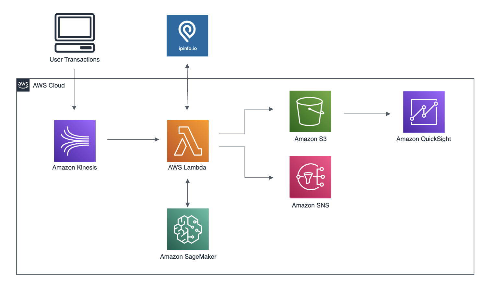

# Anomaly Detection in Transactions: A Cloud-Enabled Approach

This project explores the use of **machine learning** and **statistical techniques** to detect anomalies within a dataset of 2,500 transactions. The goal is to identify potentially fraudulent transactions by analyzing the dataset using four anomaly detection methods:

## Methods Used:
1. **K-Means Clustering**: Detects anomalies based on distance from centroids.
2. **Z-Score Analysis**: Flags extreme outliers in numeric features.
3. **Isolation Forest**: Highlights anomalous transactions using tree-based partitioning.
4. **Logistic Regression**: A supervised model used to classify transactions based on features.

The results from these methods are combined into a **Fraud Risk Score**, which helps prioritize transactions based on their likelihood of being fraudulent. The project focuses on providing **actionable insights**, with visualizations and explanations for the decisions made by the models. **LIME** was used to ensure **interpretability**, particularly for the **Logistic Regression** model, allowing users to understand how each feature contributes to the final decision.

## Key Features of the Approach:
- **Scalable Solution**: While this analysis works on a batch dataset, the approach is scalable for **real-time processing**. By integrating it into a cloud infrastructure, e-commerce platforms can monitor transactions continuously, detect anomalies, and respond to potential fraud in real-time.
- **Flexible and Interpretable**: The inclusion of **geospatial data** and **interpretability frameworks** ensures that fraud detection is not only effective but also understandable, enabling businesses to trust the system.
- **Cloud Integration**: The model can be integrated into a cloud-based infrastructure to handle larger datasets, monitor transactions in real-time, and enable businesses to act on fraud detection instantly.

## AWS Cloud Infrastructure for Real-Time Anomaly Detection

To deploy the anomaly detection model in a **real-time environment**, I have proposed a simplified architecture that leverages **AWS** services to process transactions and help in detecting frauds. Below is the basic flow of the solution:

1. **Transaction Data Inflow**: Transaction data (e.g., from payment providers / application checkout) is ingested in **AWS Kinesis** for real-time processing.
2. **Data Processing**: An **AWS Lambda** function is triggered to process the incoming transaction data. It enriches the transaction with **IP geolocation data** using the **ipinfo.io** API.
3. **Fraud Detection Model**: The enriched transaction data is sent to **AWS SageMaker**, where the **Fraud Risk Score** is computed using the pre-trained models (K-Means, Isolation Forest, Logistic Regression).
4. **Data Storage**: The results are stored in an **S3 bucket**, from where they can be queried and visualized.
5. **Visualization**: The processed results are visualized in **Amazon QuickSight** to generate dashboards and reports for easy interpretation.
6. **Alerts**: Optional **SNS** notifications are triggered for high-risk transactions to alert business owners in real-time.

### Infrastructure Components:
- **AWS Kinesis**: Ingestion of real-time transaction data.
- **AWS Lambda**: Serverless processing of data and model inference.
- **AWS SageMaker**: Running the fraud detection model.
- **Amazon S3**: Storing the results for further analysis and visualization.
- **Amazon QuickSight**: Creating dashboards to present insights from the fraud detection model.
- **Amazon SNS**: Sending notifications for high-risk transactions.

### Diagram:

## Assumptions and Limitations:
- This implementation is based on **real-time** data ingestion from e-commerce transactions and does not rely on historical batch data.
- The model is trained on a small dataset for demonstration purposes, but the architecture can scale for larger datasets and more complex models.

---

This **README** provides an overview of the project, its methodologies, and the AWS infrastructure used for real-time anomaly detection. The goal is to showcase in a simplified environment how cloud technologies, when combined with machine learning models that take into account geo-location, can address transaction anomaly detection efficiently and at any scale.